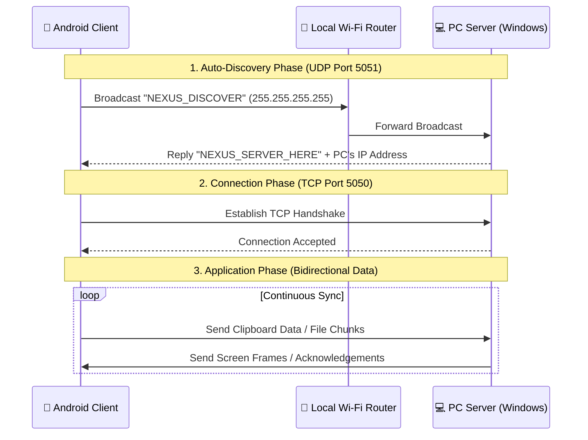

# 🔗 Nexus Link


**Nexus Link** is a cross-platform collaboration suite designed to bridge the gap between your Android device and Windows PC. It aims to deliver a seamless, "Apple Ecosystem"-like experience by enabling instant synchronization, wireless file transfers, and remote control over your local Wi-Fi network—no USB cables or external internet required.

---

## 🚀 The Vision (What it does)
Have you ever wanted to copy text on your phone and instantly paste it on your PC? Or drag a file from your computer directly into your phone's screen? Nexus Link is built to make your devices feel like a single, unified workspace. 

## 🧠 Under the Hood (How it works)
Unlike cloud-based solutions that route your data through external servers, Nexus Link operates entirely on your local Local Area Network (LAN). 

It utilizes a **Dual-Stack Socket Architecture**:
1. **The Radar (UDP Broadcast):** The Android app acts as a sonar, broadcasting a discovery packet across the network. The PC server listens and responds with its IP address, allowing the devices to find each other completely automatically. Zero manual IP configuration.
2. **The Highway (TCP Stream):** Once discovered, a persistent, high-throughput TCP connection is established for guaranteed data delivery. This handles the heavy lifting like file chunks and continuous screen mirroring frames.

### 📐 Architecture Flow



---

## 🛠️ Technology Stack
Built from scratch with a focus on raw performance and zero bloat:
- **Client (Mobile):** Native Android (Kotlin), Android SDK, `java.net.Socket`
- **Server (Desktop):** Modern C++ (MSYS2 GCC 16.1.0), CMake, Winsock2 API (Native Windows Networking)

---

## 📋 Features & Roadmap
We are building this suite iteratively. Here is our current progress:

- [x] **Project Foundation:** Android & C++ Server scaffolding.
- [x] **Modern Toolchain:** Setup MSYS2 UCRT64 GCC 16.1.0 environment.
- [x] **Zero-Config Auto Discovery:** UDP broadcast implementation.
- [x] **Core Bridge Establishment:** TCP persistent connection success.
- [ ] **Universal Clipboard Sync:** Bi-directional text copy-pasting.
- [ ] **Wireless File Transfer:** High-speed peer-to-peer file sharing.
- [ ] **Low-Latency Screen Mirroring:** Stream Android display to PC natively.
- [ ] **Drag & Drop Integration:** Move files into the mirrored screen window to transfer.

---

## 💻 Developer Guide (Getting Started)

Want to build and run Nexus Link locally? Follow these steps:

### 1. Running the Windows PC Server
Ensure you have [MSYS2](https://www.msys2.org/) installed with the `ucrt-x86_64` toolchain and CMake.
```bash
# Navigate to the server directory
cd pc-server

# Generate build files and compile
cmake -G "MinGW Makefiles" -B build
cmake --build build

# Start the server
.\build\nexus-server.exe
```
> *Note: Windows Firewall might prompt you for permission on the first run. Please allow it so UDP/TCP packets can pass through.*

### 2. Running the Android Client
Ensure your Android device is connected to the same Wi-Fi network and *Wireless Debugging* is enabled.
```bash
# Navigate to the client directory
cd android-client

# Connect to your device via ADB
adb connect <YOUR_PHONE_IP>:<PORT>

# Build and install the app
.\gradlew.bat installDebug
```

---
*Developed with ❤️ as a Native Open-Source Project.*
