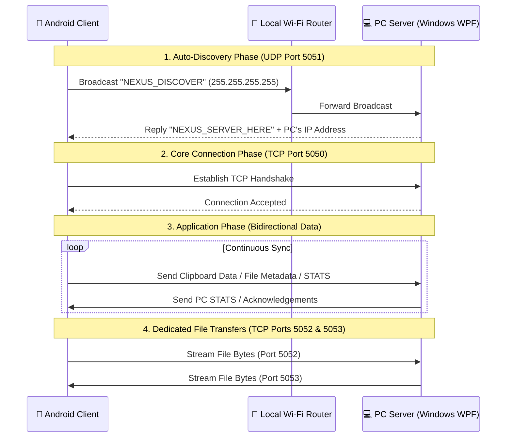

# 🔗 NexusLink


**NexusLink** is a cross-platform collaboration suite designed to bridge the gap between your Android device and Windows PC. It aims to deliver a seamless, "Apple Ecosystem"-like experience by enabling instant synchronization, wireless file transfers, shared clipboards, and live hardware monitoring over your local Wi-Fi network—no USB cables or external internet required.

---

## 🚀 The Vision (What it does)
Have you ever wanted to copy text on your phone and instantly paste it on your PC? Or send a file from your computer directly to your phone's screen seamlessly? NexusLink is built to make your devices feel like a single, unified workspace.

### Core Features
- **Auto-Discovery:** Devices find each other on the local network instantly without manual IP configuration.
- **Universal Clipboard Sync:** Send text from Android to PC using the native Share menu or a handy floating quick-action bubble.
- **Bi-directional File Transfer:** 
  - Send files from Android to PC via the Android Share menu.
  - Browse and send files from your PC directly to your connected Android phone.
- **Live System Telemetry:** 
  - **On PC:** View your Android phone's live battery status, free storage, and network speed.
  - **On Android:** Monitor your PC's remaining storage and battery life (with dynamic visual indicators).
- **Fast Local Transfers:** Bypasses internet limits by streaming data directly over your local Wi-Fi router.

---

## 🧠 Under the Hood (How it works)
Unlike cloud-based solutions that route your data through external servers, NexusLink operates entirely on your local Local Area Network (LAN). 

It utilizes a **Multi-Port Socket Architecture**:
1. **The Radar (UDP Broadcast - Port 5051):** The Android app acts as a sonar, broadcasting a discovery packet across the network. The PC server listens and responds with its IP address, allowing the devices to find each other automatically.
2. **Command & Telemetry (TCP - Port 5050):** A persistent connection used for heartbeat signals (`INFO`), system stats (`STATS`), and clipboard sharing (`CLIP`).
3. **Android to PC File Transfer (TCP - Port 5052):** A dedicated socket channel for high-speed incoming file transfers from the phone to the computer.
4. **PC to Android File Transfer (TCP - Port 5053):** A dedicated socket channel for pushing files from your desktop straight to your phone's Downloads folder (`FILE_SEND`).

### 📐 Architecture Flow



---

## 🛠️ Technology Stack
Built from scratch with a focus on native performance and modern UI guidelines:
- **Client (Mobile):** Native Android (Kotlin), XML Layouts, Android SDK, standard `java.net.Socket`. Features native OS integrations like Share Intent Receivers and Floating Window Services.
- **Server (Desktop):** C# .NET 8 WPF (Windows Presentation Foundation). Utilizing native TCP/UDP Listeners, `DriveInfo`, and `PowerStatus` APIs for deep Windows integration. UI designed with Material Design In XAML.

---

## 💻 Developer Guide (Getting Started)

Want to build and run NexusLink locally? Follow these steps:

### 1. Running the Windows PC Server
Ensure you have the [.NET 8 SDK](https://dotnet.microsoft.com/en-us/download/dotnet/8.0) installed.
```powershell
# Navigate to the server directory
cd pc-server-wpf

# Run the WPF application
dotnet run
```
> *Note: Windows Firewall might prompt you for permission on the first run. Please allow it so UDP/TCP packets can pass through on ports 5050-5053.*

### 2. Running the Android Client
Ensure your Android device is connected to the same Wi-Fi network and *Wireless Debugging* is enabled.
```bash
# Navigate to the client directory
cd android-client

# Connect to your device via ADB (or use Android Studio)
adb connect <YOUR_PHONE_IP>:<PORT>

# Build and install the debug APK
./gradlew assembleDebug
adb install app/build/outputs/apk/debug/app-debug.apk
```

---
*Developed with ❤️ as a Native Open-Source Project.*
